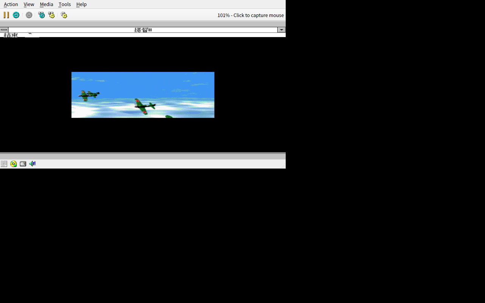
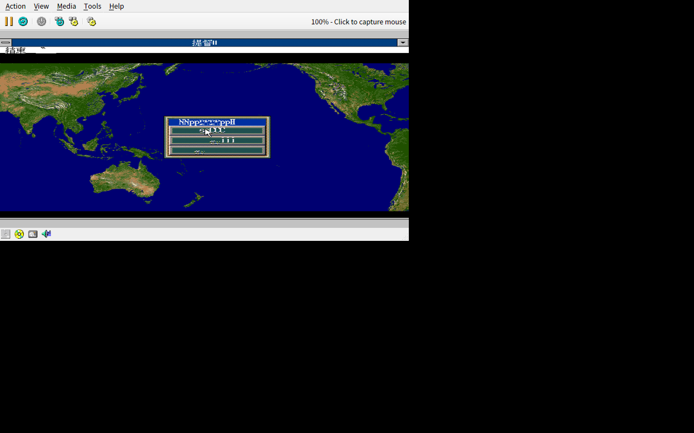
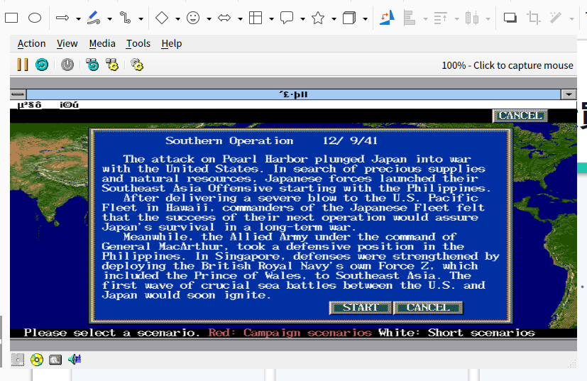

# 提督之決斷 II 繁體中文化

> 「還記得嗎？1990 年代中期的某個深夜，你對著 640×480 的螢幕，手邊是剛從書店買回來的《軟體世界》，正在研究怎麼讓艦隊繞過馬紹爾群島……」

這個 repo 是把英文加強版《P.T.O. II: Pacific Theater of Operations II》（1996）重新繁體中文化的紀錄。

## 🎮 遊戲介紹

《提督之決斷 II》（日文原名：提督の決断II，英文：*P.T.O. II: Pacific Theater of Operations II*）是日本光榮（KOEI）以第二次世界大戰太平洋戰場為背景的海軍戰略模擬遊戲。玩家可以扮演**大日本帝國海軍聯合艦隊司令長官**或**美國海軍太平洋艦隊總司令**，從 1941 年（或自選劇本）開始指揮艦隊、潛艇、航空母艦與陸戰隊，橫跨整個太平洋與敵方決戰。

本作最早於 1993 年在 PC-9801 推出，後來移植到 SFC、SEGA Saturn、PlayStation、FM Towns 與 DOS／Windows 等平台。英文 Windows 版於 1996 年在北美上市，也是本專案的改製基礎。

## 📅 1995 年與中文版

- **1995 年 2 月 17 日**：SFC 版《提督の決断II》在日本發售，這是系列首次登上 16-bit 家用主機。
- **1996 年**：DOS 繁體中文版《提督之決斷II》在台灣上市，由光榮自行開發／發行，是當年中文 PC 玩家最熟悉的版本之一。
- **1996 年**：英文 Windows 版（即本專案使用的「英文加強版」）上市，畫面改用 WinG/CD 音軌，並加入開場動畫。

也就是說，當年中文玩家多半玩的是 DOS 版；這次我們要做的，是讓英文 Windows 加強版也能說中文。

## ✨ 為什麼中文化這個版本

當年的繁體中文版只有 DOS 版。DOS 版雖然是華人玩家最熟悉的版本，但它是從 PC-98 版直接移植的「原版」：640×400、FM 音源、沒有 CD 音軌、沒有過場動畫，劇本與事件演出也比較陽春。

英文 Windows 版（1996）則是**真正的加強版**：

- 解析度提升到 640×480／SVGA
- 使用 WinG 加速繪圖，畫面更流暢
- 加入 CD 音軌與開場／事件動畫
- 劇本與事件演出更完整（`MSG1.TK2`、`SCESETSU.TK2`、`SCESTART.TK2` 等文字量比 DOS 版多）
- 遊戲機制最完整（艦船設計、航空隊調度、情報戰、外交、陸戰隊佔領等系統全部到位）

簡單說：**這是當年華人玩家沒辦法體驗到的完整版**。我們要做的，就是把這個加強版補上繁體中文，讓它成為真正屬於中文玩家的《提督之決斷 II》。

## ⚙️ 遊戲機制

《提督之決斷 II》是典型的「戰略層 + 戰術層」雙層設計：

| 層級 | 玩法 | 重點 |
|------|------|------|
| **戰略層** | 回合制 | 管理艦隊編成、造船／造機、資源調度、外交、佔領島嶼、人事任命 |
| **戰術層** | 半即時海戰 | 在六角格或開闊海域地圖上移動艦隊，進行艦砲、魚雷、空襲、潛艇攻擊 |

### 核心系統

- **艦隊編成**：戰艦、空母、巡洋艦、驅逐艦、潛艇可以混編成特遣艦隊，燃料與彈藥會影響續航力。
- **艦載機與陸基航空隊**：制空權是關鍵，零戰、F4F、SBD、九七艦攻等機種各有航程與載彈限制。
- **艦船設計**：部分劇本允許你自行設計新艦，調整裝甲、速度、主砲與魚雷配置。
- **陸戰隊與佔領**：奪取瓜島、塞班、硫磺島等據點需要登陸部隊與護航艦隊。
- **情報與外交**：偵察機、潛艇巡邏與密碼破譯會影響你對敵艦位置的判斷；部分劇本還有德國或英國勢力互動。
- **多劇本**：除了長期戰役（1941–1945），也有短劇本讓你專攻中途島、珊瑚海、瓜達康納爾等經典會戰。

## 🛠️ 本專案在做什麼

我們對英文 Windows 版的資源進行中文化：

- 解碼 `NPK016` 圖檔，把 UI 按鈕、面板、標題重繪為繁體中文
- 抽出 `.TK2` 文字檔與資料表名稱，製作譯表後回填
- 逆向 `TEKE2WIN.EXE` 的繪字管線，加入繁體中文字型 atlas 與 2-byte hook
- 最後打包成 Linux AppImage 與 Windows 可執行包

## 📸 目前進度截圖

繁體中文 Windows 3.1（86Box）實機運行：

| 開場動畫 | 主選單（亂碼修復中） | 劇本畫面 |
|---|---|---|
|  |  |  |

## 📁 目錄結構

```
.
├── AGENTS.md           # 專案指令
├── PLAN.md             # 中文化計畫
├── README.md           # 本文件
├── assets/             # 遊戲資產（原版與解出的圖檔，不上 git）
├── docs/               # 技術文件
├── fonts/              # 中文字型 atlas
├── packaging/          # AppImage / Windows 打包腳本
├── patch/              # 補丁後的遊戲檔案
├── tools/              # 解碼 / 編碼 / 注入工具
└── translation/        # 譯表
```

## ⚠️ 版權聲明

本 repo **只包含自製工具、譯表與技術文件**，不含原版遊戲資料。玩家需自行擁有合法的原版光碟。打包後的完整版僅供個人使用，請勿公開散佈。

## 🚀 如何使用

（待第一版補丁完成後補上）
